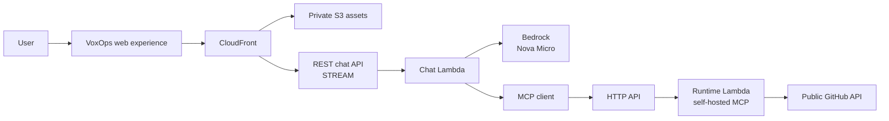

# VoxOps

VoxOps is a developer assistant for Alexa+ that reads the state of an allowlisted public GitHub repository through a live, self-hosted MCP server.

## Live demo

**[Try the simulated Alexa+ experience](https://d190htydn0gfle.cloudfront.net/)** — ask what is happening with VoxOps, inspect the streamed answer and MCP tool activity, and compare the result with the [public repository](https://github.com/ibodev1/voxops). No login or AWS credentials are needed. This web experience simulates Alexa+; it is not an official Alexa Add-on or Web Simulator.

## Architecture



The separate REST API and Chat Lambda stream model responses. The HTTP API serves `GET /health` and `POST /mcp` and has no chat route. The final source revision adds `GET /mcp` to return the spec-required 405 when standalone SSE is unavailable; that route needs manual deployment before judging. AWS currently supports API Gateway response streaming only for REST APIs, so the two APIs have distinct jobs.

## What it does

The web experience accepts natural-language questions, streams an Amazon Nova Micro answer, shows each MCP tool call separately, and fills a live repository-context panel. The agent gets repository facts only through VoxOps MCP; that server calls GitHub anonymously. VoxOps currently accepts only `ibodev1/voxops`, checks that GitHub reports it as public, and offers exactly four read-only tools:

| MCP tool                | Reads                                   |
| ----------------------- | --------------------------------------- |
| `get_repository_status` | Metadata, default branch, latest commit |
| `list_open_issues`      | Open issues, excluding pull requests    |
| `list_pull_requests`    | Open pull requests                      |
| `list_workflow_runs`    | Recent GitHub Actions runs              |

The live MCP server uses Streamable HTTP. Its current SDK negotiates `2026-07-28` with an up-to-date client and accepts a `2025-11-25` initialize request, meeting the [Alexa+ hackathon MCP minimum](https://amazonappdev2026.devpost.com/rules). The Alexa Add-on itself has not been onboarded or tested.

## Technology

TypeScript, pnpm, React, Vite, Hono, the official MCP TypeScript SDK, Octokit, Zod, Vercel AI SDK, Amazon Bedrock (EU Nova Micro inference profile), AWS Lambda, API Gateway HTTP and REST APIs, CloudFront, private S3, and AWS CDK.

## Run locally

Use Node.js 24 and pnpm 11.23.0. In one PowerShell terminal:

```powershell
pnpm install --frozen-lockfile
$env:VOXOPS_PUBLIC_REPOSITORIES = 'ibodev1/voxops'
$env:AWS_PROFILE = '<temporary-non-root-profile>'
$env:AWS_REGION = 'eu-central-1'
pnpm dev:server
```

In another terminal, run `pnpm --filter @voxops/web dev` and open `http://127.0.0.1:5173`. Vite proxies `/api` to the loopback server. Chat needs temporary AWS credentials with Bedrock access; MCP and health do not. To test MCP without Bedrock, use `pnpm mcp:smoke` while the server is running. To test the live server, set `VOXOPS_MCP_URL` to the [public MCP endpoint](https://sb8ffkmwta.execute-api.eu-central-1.amazonaws.com/mcp) before running the same smoke command. The [technical walkthrough](docs/technical-walkthrough.md) explains the code and the [environment table](docs/environment.md) lists every setting.

## AWS deployment and tests

CDK defines two 256 MB ARM64 Lambdas, two API Gateways, CloudFront, one private S3 bucket, and seven-day log groups. It does not upload web assets. Review [AWS development](docs/aws-development.md) for non-root deployment, upload, and smoke commands; use the [cleanup runbook](docs/cleanup.md) after judging. CI requires no AWS account and never deploys.

```powershell
pnpm format:check
pnpm lint
pnpm typecheck
pnpm test
pnpm infra:synth
pnpm --filter @voxops/web build
```

## Hackathon scope

VoxOps is public-data only, read-only, and limited to one allowlisted demo repository. It has no private GitHub access, write actions, account linking, OAuth, Alexa Add-on deployment, database, or persistent user state. API Gateway throttling limits ordinary load but is not a hard billing cap. Anonymous GitHub rate limits and public access are deliberate demo limits. See the [judge instructions](submission/testing-instructions.md) and [final architecture decision](docs/decisions/0010-final-hackathon-architecture.md).

## AI-assisted development and license

AI coding tools including Codex assisted development. The developer made the architecture and security decisions, reviewed the code, and manually verified the deployed demo end to end. VoxOps is licensed under the [MIT License](LICENSE). Before submitting, verify GitHub displays the license in the repository About section.
