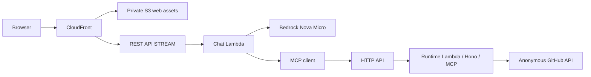
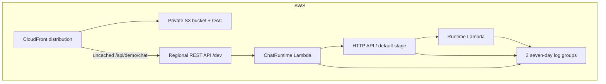
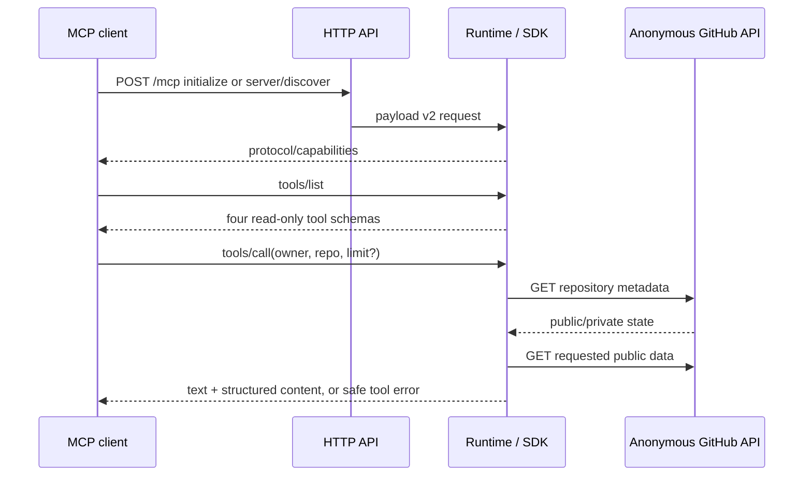
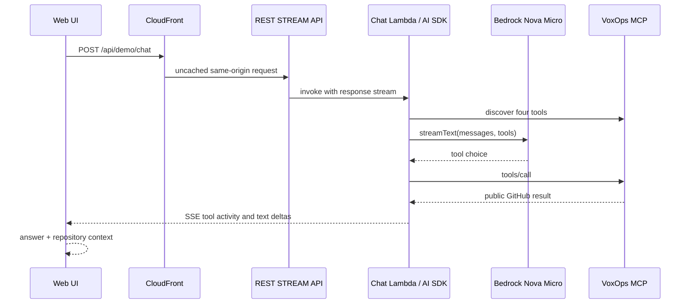

# VoxOps technical walkthrough

This is a guide to the current code for its developer. Start with the [README](../README.md) for the short product view and [ADR 0010](decisions/0010-final-hackathon-architecture.md) for the final scope. Earlier private GitHub and OAuth ADRs are history. The final `GET /mcp` compliance fix requires manual AWS deployment before it is true of the live endpoint.

## 1. Repository map and deployment shape

| Location                                          | Job                                                                                              | If removed, what breaks?                                              |
| ------------------------------------------------- | ------------------------------------------------------------------------------------------------ | --------------------------------------------------------------------- |
| `apps/web`                                        | React conversation, streaming display, tool activity, repository context; Vite local proxy/build | The public simulated experience disappears.                           |
| `apps/server/src/app.ts`, `lambda.ts`, `mcp.ts`   | Hono routes, Lambda payload-v2 adapter, four MCP tools                                           | Health and remote MCP stop working.                                   |
| `apps/server/src/demo-agent.ts`, `chat-lambda.ts` | AI SDK/Bedrock orchestration and REST Lambda response streaming                                  | Conversational chat stops; MCP can still answer tools.                |
| `apps/server/src/index.ts`                        | Loopback local server and local streaming chat adapter                                           | Local development server stops; deployed Lambdas do not depend on it. |
| `packages/contracts`                              | Zod request and GitHub result schemas shared at boundaries                                       | MCP input validation and typed tool results break.                    |
| `packages/github`                                 | Anonymous Octokit reads, allowlist, public check, safe errors                                    | All four MCP tools lose their GitHub data source and access guard.    |
| `infra`                                           | CDK stack, routes, IAM, logs, CloudFront, S3 and outputs                                         | The AWS environment cannot be reproduced or reviewed.                 |
| `scripts/mcp-smoke.ts`                            | Real MCP protocol/tool smoke test                                                                | Remote protocol and public-data checks lose their repeatable probe.   |

The deployment has two Node.js 24 ARM64, 256 MB Lambdas. **Runtime** starts `lambda.ts`, constructs the allowlisted GitHub client, then lets Hono's AWS adapter translate API Gateway HTTP API payload-v2 events into Web Requests. It serves health without GitHub access and routes MCP requests to the official SDK handler. **ChatRuntime** starts `chat-lambda.ts`, validates a chat request, connects to the public MCP URL, calls Bedrock through `streamDemoChat`, and writes UI-message SSE to Lambda's response stream. There is no always-on server, database, Secrets Manager dependency, or background inference.

## 2. Why two APIs and Lambdas

The HTTP API has explicit routes for `GET /health`, `POST /mcp`, and a finalization fix for `GET /mcp`. The GET MCP path delegates to the SDK, which returns 405 when it offers no standalone SSE stream, as required by the 2025-11-25 transport specification. Invalid cross-origin GET and POST requests receive 403. There is no `$default` route or remote buffered chat route.

The regional REST API has only `POST /api/demo/chat` with `ResponseTransferMode.STREAM` and the response-streaming Lambda invocation URI. [AWS currently supports API Gateway response streaming only for REST APIs](https://docs.aws.amazon.com/apigateway/latest/developerguide/response-transfer-mode.html). The HTTP API is simpler for MCP's small request/response calls; the REST API is needed for incremental chat. Merging the two Lambdas would make those different invocation contracts harder to reason about without improving the demo.

CloudFront uses Origin Access Control to sign requests to the private S3 bucket. The default behavior serves static Vite files; the exact chat behavior forwards to the REST stage without caching or the viewer's Host header. CDK provisions the bucket and distribution; a developer builds, uploads, and invalidates web files manually. The repository-context panel is derived from successful MCP tool-result events in the same browser chat stream; it has no separate GitHub request or stored snapshot.

## 3. MCP lifecycle and GitHub reads

The official `@modelcontextprotocol/server` creates the four tool definitions in `mcp.ts`; `@modelcontextprotocol/hono` handles local HTTP and the same SDK handler serves the Lambda route. A 2025-era client first sends `initialize` with a proposed version, receives the negotiated `protocolVersion`, sends `notifications/initialized`, then uses `tools/list` and `tools/call`. The current SDK also supports the newer stateless `2026-07-28` discovery flow. The live server accepted an explicit `2025-11-25` initialize and the SDK smoke client negotiated `2026-07-28` on 2026-09-18. `scripts/mcp-smoke.ts` fails if the negotiated version falls below the hackathon minimum.

The tools are `get_repository_status` (metadata, default branch and latest commit), `list_open_issues` (open issues, excluding PRs), `list_pull_requests` (open PRs), and `list_workflow_runs` (recent GitHub Actions). The first accepts owner/repo; the list tools also accept a limit of 1–25, default 10. `packages/contracts` validates remote arguments and structured results with Zod. `packages/github` rejects a name outside the configured allowlist **before** a GitHub request. It then makes an anonymous repository metadata request and rejects anything GitHub does not report as public before making the operation-specific request. It maps 404/403/rate-limit/upstream failures to a small error kind; `mcp.ts` returns fixed user-facing messages, never the upstream exception. No write method or PAT/GitHub App authentication is present.

## 4. Chat and streaming lifecycle

`DemoChatRequestSchema` accepts only alternating user/assistant messages, at most seven messages, 400 characters each and 2,400 characters total. `chat-lambda.ts` also limits the raw body to 4,096 bytes and checks JSON/content type before opening MCP or Bedrock. It uses the Lambda `awslambda.streamifyResponse` and `HttpResponseStream.from` adapter, then pipes the AI SDK `ReadableStream` into the AWS writable stream. The local `index.ts` uses the same `streamDemoChat` function through Hono to support Vite development.

`demo-agent.ts` creates the official MCP client, confirms all four named tools exist, and maps each to an AI SDK `tool` with Nova-compatible JSON schema and local Zod validation. Each execution calls MCP, never GitHub directly. It selects `eu.amazon.nova-micro-v1:0` through `@ai-sdk/amazon-bedrock` and the standard AWS temporary-credential provider chain. The EU inference profile may route inference among its documented EU destinations; IAM allows streaming invocation only on that profile and conditioned destination model ARNs. `streamText` forces a tool decision in the first step, permits at most four model steps and at most six MCP calls, and sets a 350-token output limit per model call; automatic model retries are disabled.

The AI SDK converts the result to its UI-message Server-Sent Events. Text deltas and tool input/output are separate event types, so the web can show live tool activity independently of the answer. `thinkingFilter` operates only on model text deltas, including delimiters split across chunks; it removes literal `<thinking>...</thinking>` blocks and fails closed on incomplete blocks. The UI stream also has `sendReasoning: false`. Provider and MCP failures are replaced by fixed public messages; raw stack traces and provider diagnostics are not sent to the browser. The web uses `@ai-sdk/react` `useChat` to render incremental text, history, retry, and context. React escapes displayed GitHub text.

## 5. Security, configuration, tests, and failure modes

The [environment table](environment.md) is authoritative. Local development binds to `127.0.0.1` and can use a temporary AWS profile for chat. Production CDK sets the allowlist on Runtime and the remote MCP URL on ChatRuntime; Lambda supplies region/temporary role credentials. Neither browser bundle nor repository contains production credentials. The current public API is deliberately unauthenticated because every tool is user-independent and public-data only. Authentication would be required before private data or writes.

IAM has separate Runtime and Chat roles with log-write access to their own groups. Runtime has no Bedrock permission. Chat has only `bedrock:InvokeModelWithResponseStream` on the named inference profile and conditioned EU model ARNs. CloudFront's S3 origin is private; no wildcard browser CORS is enabled on REST. HTTP API access logs contain request metadata but not bodies or headers. All three log groups retain seven days. The REST chat stage limits ordinary pressure to 2 requests/second with burst 2; this is best effort, not a billing cap. AWS Budgets is an external account control.

Deterministic tests cover allowlist and private-repo rejection, exactly four read-only tools, both MCP protocol eras, Lambda health, safe errors, AI SDK tool mapping and bounded calls, split thinking tags, UI stream structure, IAM, routes, logging, throttle, streaming integration, and S3/CloudFront privacy. CI installs the lockfile, formats, lints, typechecks, tests, synthesizes CDK, and builds the web app without AWS credentials. The real MCP smoke script is separate because it reads live GitHub data. See [judge instructions](../submission/testing-instructions.md) for low-volume remote checks.

Expected failures are explicit: a nonallowlisted or private repository returns a safe MCP tool error; anonymous GitHub rate limiting returns a retry-later message; missing Bedrock access or MCP availability returns a generic chat-unavailable response; malformed chat input is rejected before inference. A client holding an old web page during manual asset replacement can briefly miss a deleted hashed asset. Use [AWS development](aws-development.md) for reviewed deployment and [cleanup](cleanup.md) after judging. CDK bootstrap is shared account infrastructure and is not removed by VoxOps cleanup.
