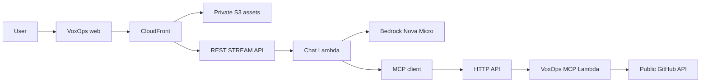

# Devpost submission copy — VoxOps

Copy the English field text below into Devpost after the final manual MCP route deployment and smoke check. Replace `[DEMO_VIDEO_URL]` with the public YouTube/Vimeo link before submission. Confirm GitHub detects the MIT license. The [current rules](https://amazonappdev2026.devpost.com/rules) require a public repository with an open-source license, a working demo, and a video under three minutes. Submit before the deadline shown on Devpost.

## Project name

VoxOps

## Tagline / elevator pitch

Ask about a public GitHub repository and watch a live MCP-powered answer stream back.

## Short description

VoxOps is a voice-first developer assistant for Alexa+. Its self-hosted MCP server exposes four read-only tools for public GitHub repository status, issues, pull requests, and workflows. A simulated Alexa+ web experience uses Amazon Bedrock Nova Micro to choose those tools, stream an answer, and show the live evidence behind it.

## Full project story

### Problem

A developer checking a repository often has to open separate pages for the latest commit, open work, pull requests, and CI runs. A conversational status check is useful only if it reads current data and shows which sources it used.

### What VoxOps does

VoxOps answers questions about the public `ibodev1/voxops` repository. Its four MCP tools are `get_repository_status`, `list_open_issues`, `list_pull_requests`, and `list_workflow_runs`. They return structured results and readable text. The web experience streams a natural-language answer, shows tool activity as it happens, and fills a repository-context panel from those same results. Judges can compare the answer with the live GitHub repository. No login is required.

### How it works

The browser loads static assets from CloudFront and a private S3 bucket. Its same-origin chat request goes through an uncached CloudFront behavior to an API Gateway REST `STREAM` integration and a dedicated Chat Lambda. Vercel AI SDK `streamText` calls Amazon Nova Micro through the EU Bedrock inference profile. The model can select only the four mapped tools. Each tool call uses the official MCP TypeScript client to reach the same public VoxOps MCP server that a separate client can test. That server runs on a Runtime Lambda behind an API Gateway HTTP API, validates the repository name against an allowlist, checks that GitHub reports it as public, then uses anonymous Octokit reads. The final answer and tool events travel back as incremental SSE.

### Alexa+ track

VoxOps follows the **working self-hosted MCP server** path in the [Alexa+ track rules](https://amazonappdev2026.devpost.com/rules). It uses the official SDK and Streamable HTTP. The live endpoint accepted a `2025-11-25` initialize request, the minimum protocol version in the rules, and an up-to-date SDK client negotiated `2026-07-28`. All four tools were invoked successfully against the public repository. The web page is an **optional simulated Alexa+ experience** backed by this real MCP server. It is not an official Alexa Add-on or Alexa Web Simulator; I did not claim account linking or Alexa device integration.

### AWS Builder mini challenge

VoxOps uses AWS at runtime: Lambda runs both MCP and chat; API Gateway exposes the HTTP and REST streaming routes; Amazon Bedrock runs Nova Micro; CloudFront and private S3 host the web experience; CloudWatch Logs retain operational logs for seven days. AWS CDK defines the stack. The Bedrock call, Lambda streaming adapter, and API Gateway integrations are implemented in the repository, not merely listed in documentation.

### What is working

The public health endpoint, remote MCP protocol exchange, four read-only tools, direct REST chat stream, same-origin CloudFront chat stream, visible tool events, final Nova answer, and repository-context UI were tested against the live deployment. The browser needs no AWS credentials. The server reveals no model reasoning or literal `<thinking>` blocks. CI tests and CDK synthesis run without an AWS account.

### Current scope and limitations

The demo reads one allowlisted public repository only. There is no private GitHub access, GitHub write action, OAuth, account linking, Alexa Add-on deployment, or database. Anonymous GitHub rate limits can affect a busy demo. API Gateway throttling is best-effort load/cost protection, not a hard spending cap. Model summaries should be checked against the visible tool results when accuracy matters.

### Challenges and learning

True streaming required a separate REST API and Chat Lambda because API Gateway response streaming is available for REST APIs, while the existing HTTP API remains a simple MCP boundary. Nova Micro needed an effective quota and a cross-region inference profile in this region. The AWS account's small Lambda concurrency allocation rejected reserved concurrency, so I removed the reservation and used conservative REST-stage throttling. Alexa AI CLI onboarding hit a cross-account role-assumption denial; I kept the self-hosted MCP and accurately labeled the web simulation instead of claiming untested official Add-on behavior. A final spec audit also caught a missing `GET /mcp` 405 response and added the narrow route and regression checks. The detailed factual history is in [the friction log](https://github.com/ibodev1/voxops/blob/main/docs/friction-log.md).

### What's next

The hackathon build is feature complete. Future private-repository support would need verified user identity, Alexa-compatible account linking, and GitHub authorization tied to each user. Write actions would need narrow permissions and explicit confirmation. Neither is part of this submission.

### AI-assisted development disclosure

I used AI coding tools such as Codex during development. I designed the architecture, made the product and security decisions, reviewed the generated code, and manually tested the live system end to end.

## Technologies used

TypeScript, React, Vite, Hono, Zod, Octokit, the official MCP TypeScript SDK, Vercel AI SDK, Amazon Bedrock, Amazon Nova Micro EU inference profile, AWS Lambda, Amazon API Gateway HTTP API and REST API, Amazon CloudFront, Amazon S3, Amazon CloudWatch Logs, AWS CDK, GitHub Actions, and pnpm.

## Links and testing

- GitHub source: https://github.com/ibodev1/voxops
- Public live demo: https://d190htydn0gfle.cloudfront.net/
- Public MCP: https://sb8ffkmwta.execute-api.eu-central-1.amazonaws.com/mcp
- Public demo video: [DEMO_VIDEO_URL]
- Judge steps: https://github.com/ibodev1/voxops/blob/main/submission/testing-instructions.md

Open the live demo and ask “What's happening with VoxOps?” or “How are the recent workflows doing?” Watch text arrive incrementally and inspect MCP tool activity. Compare the result with the public repository. No login or AWS credentials are required.

## Track selection

- **Primary track:** Alexa+ — working self-hosted MCP server over Streamable HTTP, with an optional simulated web experience.
- **Mini challenge:** AWS Builder — actual Lambda, API Gateway, Bedrock, CloudFront, S3, and CloudWatch runtime integration.
- **Open Source mini challenge:** **Not entered.** Making this primary repository public is not a separate qualifying contribution.

## Product feedback

### Which developer tools, APIs, and SDKs did you use, and for what?

- Alexa+/MCP: I used the open MCP specification and TypeScript server/client SDK to publish and consume four discoverable read-only tools. I investigated the Alexa AI CLI, but did not deploy an Add-on.
- Amazon Bedrock/Nova Micro and AI SDK: Nova Micro interprets repository questions and selects tools. AI SDK `streamText` maps tools and emits incremental UI-message SSE; Bedrock is the live model runtime.
- AWS Lambda/API Gateway: An HTTP API invokes the MCP Runtime Lambda; a regional REST API with `STREAM` invokes the Chat Lambda for incremental responses.
- CloudFront/S3/CDK/CloudWatch: CloudFront serves a Vite build from private S3 and forwards chat; CDK defines the stack; seven-day logs and API metrics aid debugging.
- Octokit/GitHub API, Zod, React/Vite: Octokit reads live public repository state, Zod validates boundaries, and React/Vite implements the browser demo.

### What worked well?

The open MCP protocol let me verify tools independently of the Alexa developer environment. The official SDK handled tool schemas and transport; AI SDK handled the streaming model/tool lifecycle and browser protocol. CDK synthesis and rollback made infrastructure changes reviewable. CloudFront with private S3 gave a simple public web surface, and API Gateway plus Lambda kept the compute on demand.

### What needs work?

Alexa AI CLI installation depended on cross-account CodeArtifact role access that the developer account could not obtain; the exact trust failure was not exposed locally. Alexa authentication guidance required careful interpretation for a public, user-independent MCP server. Bedrock Nova quotas started at zero in this account and required an increase request. API Gateway HTTP API did not offer the REST API's response-streaming mode, so a second API was needed. The low Lambda account concurrency allocation prevented even a two-execution reservation. Clearer onboarding diagnostics, quota visibility, and API capability comparison would save time.

### How was onboarding from zero to hello world?

The local MCP server and anonymous GitHub reads were quick to validate. CDK bootstrap and Lambda health were straightforward once identity and deployment commands were understood. The first Bedrock chat took longer because model quota, regional inference-profile IAM, response streaming, and Alexa CLI access had to be addressed separately. The final test path used the live self-hosted MCP and the clearly labeled web simulation.

### Would you build with these devices and services again?

**Yes** for MCP, Bedrock, and the serverless AWS stack: their open protocol and on-demand services fit this read-only demo. I would verify quotas, account concurrency, and the exact API Gateway streaming capability at the start. I would revisit the Alexa Add-on only after official CLI access and an end-to-end authentication compatibility test.

## Optional feature requests

| Request                                                                                                               | Why it mattered                                                                                                       | Priority  |
| --------------------------------------------------------------------------------------------------------------------- | --------------------------------------------------------------------------------------------------------------------- | --------- |
| Document and diagnose the full Alexa AI CLI cross-account CodeArtifact trust/onboarding path for external developers. | The role assumption was denied even after local `sts:AssumeRole` permission was checked, blocking a live Add-on test. | Critical  |
| Show HTTP API versus REST API response-streaming support prominently in API Gateway/CDK guidance.                     | The working MCP HTTP API could not carry incremental chat, requiring a second API.                                    | Important |
| Show effective Bedrock model/profile quota and the increase path before first invocation.                             | The account's initial Nova quota was zero, delaying the first live call.                                              | Important |

## Optional friction-log entries for the Devpost field

The full log is in the repository. These examples are actual development incidents, not hypothetical feature requests:

1. **Alexa CLI onboarding (High):** Attempted to install the CodeArtifact-hosted CLI after granting local `sts:AssumeRole`. Expected role assumption and package access; cross-account assumption was denied, with cause unverified. Workaround: submit support feedback and use the working self-hosted MCP plus clearly labeled simulation. Suggestion: publish trust prerequisites and denial diagnostics.
2. **Nova quota (Medium):** Attempted a small on-demand model invocation. Expected a working initial quota; actual allocation was zero. Workaround: request an increase and verify a real call. Suggestion: expose effective profile quota during onboarding.
3. **API Gateway streaming (Medium):** Attempted to use the existing HTTP API for incremental chat. Expected one API; AWS documents `STREAM` response transfer only for REST APIs. Workaround: dedicated REST chat integration and Lambda. Suggestion: emphasize the capability difference in product comparison and examples.
4. **Lambda concurrency (Medium):** Attempted to reserve two ChatRuntime executions. Expected a small cost limit; CloudFormation rejected it because unreserved account concurrency would fall below 10. Workaround: remove the reservation and use REST-stage 2 requests/second, burst 2. Suggestion: surface the remaining unreserved minimum during CDK review.
5. **MCP transport GET (High):** Audited the live `/mcp` path. Expected SSE or 405 on GET under the 2025-11-25 spec; API Gateway returned 404 because only POST was routed. Workaround: add a GET route to the SDK's 405 handler and test Origin rejection; manual deployment is required. Suggestion: include GET status in protocol smoke guidance.
